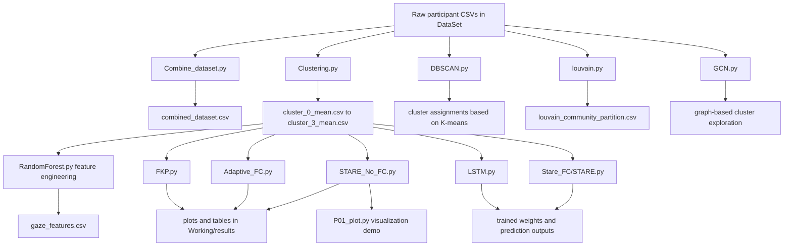

# Gaze Prediction via Fractional-Order Modeling

## Executive Summary

This repository implements an eye-gaze analysis pipeline for player behavior modeling and gaze trajectory prediction. The project combines classical clustering, fractional calculus, graph-based analysis, and deep learning to study gaze dynamics across 24 participants. The data source is a folder of participant CSV files in [DataSet](DataSet), and the main code lives in [Working](Working).

The central idea is to cluster players by gaze behavior, derive cluster-level or sequence-level features, and then use multiple prediction models to forecast future gaze coordinates. Several scripts generate intermediate artifacts such as combined datasets, cluster summaries, engineered features, model weights, and evaluation plots.

## Project Metadata

- Project name: Gaze Prediction via Fractional-Order Modeling
- Problem statement: predict future gaze coordinates from historical gaze sequences while analyzing behavioral similarity across players
- Main domain: eye-tracking analytics for interactive/gameplay-style sessions
- Primary input: participant CSV files in [DataSet](DataSet)
- Primary outputs: clustered player CSVs, feature tables, trained model weights, and comparison plots

## Technologies Used

- Python
- Pandas and NumPy for data processing
- Matplotlib and Seaborn for visualizations
- Scikit-learn for clustering and preprocessing
- PyTorch for deep learning models
- Torch Geometric for graph convolution experiments
- NetworkX and python-louvain for graph/community analysis

## Repository Structure

### Data folders

- [DataSet](DataSet): raw participant gaze CSV files such as P01_PLAY.csv through P24_PLAY.csv
- [Working/Dataset](Working/Dataset): cluster-level mean CSVs generated by clustering scripts
- [Working/results](Working/results): plots and evaluation tables generated by model scripts
- [Materials](Materials): research PDFs and background references, not part of the execution pipeline

### Core code files

| File | Role |
|---|---|
| [Working/Combine_dataset.py](Working/Combine_dataset.py) | merges all raw participant CSVs into a single combined dataset |
| [Working/Clustering.py](Working/Clustering.py) | builds player similarity features and performs spectral clustering |
| [Working/DBSCAN.py](Working/DBSCAN.py) | despite the filename, performs K-means clustering on player gaze statistics |
| [Working/louvain.py](Working/louvain.py) | builds a gaze similarity graph and applies Louvain community detection |
| [Working/GCN.py](Working/GCN.py) | graph-based clustering and node embedding experiment using PyTorch Geometric |
| [Working/RandomForest.py](Working/RandomForest.py) | feature-engineering pipeline for gaze statistics, ROI features, fixation metrics, and fractional derivatives |
| [Working/Adaptive_FC.py](Working/Adaptive_FC.py) | adaptive fractional calculus predictor with per-step alpha optimization |
| [Working/FKP.py](Working/FKP.py) | fractional Kalman filter predictor |
| [Working/STARE_No_FC.py](Working/STARE_No_FC.py) | STARE-style transformer baseline without fractional calculus |
| [Working/LSTM.py](Working/LSTM.py) | hybrid STARE + fractional calculus + LSTM multi-step predictor |
| [Working/Stare_FC/STARE.py](Working/Stare_FC/STARE.py) | fractional-calculus-aware STARE model with train/validation/test split |
| [Working/P01_plot.py](Working/P01_plot.py) | raw gaze trajectory and density heatmap visualization for a participant |

### Generated artifacts

- Root level cluster outputs: [cluster_0_mean.csv](cluster_0_mean.csv), [cluster_1_mean.csv](cluster_1_mean.csv), [cluster_2_mean.csv](cluster_2_mean.csv), [cluster_3_mean.csv](cluster_3_mean.csv)
- Root-level cluster mapping outputs: [clustered_players_based_on_gaze.csv](clustered_players_based_on_gaze.csv), [louvain_community_partition.csv](louvain_community_partition.csv)
- Feature table: [gaze_features.csv](gaze_features.csv)
- Trained weights: [stare_fc_lstm_multistep.pth](stare_fc_lstm_multistep.pth), [stare_fc_xy_t_multistep.pth](stare_fc_xy_t_multistep.pth), and model checkpoints under [Working](Working)
- Evaluation artifacts: [Working/results/tables](Working/results/tables) and [Working/results/plots](Working/results/plots)

## Problem Statement and Objective

The project asks whether gaze movement can be modeled as a memory-dependent process and whether gaze behavior can be grouped into meaningful player communities before prediction. In practical terms, it tries to answer two questions:

1. Which players exhibit similar gaze patterns?
2. How accurately can future gaze coordinates be predicted from prior gaze history using fractional-order or deep sequence models?

The system therefore serves both descriptive analytics and predictive modeling.

## End-to-End Workflow

### Workflow explanation

1. Raw gaze data is loaded from [DataSet](DataSet).
2. Participant-level or cluster-level summaries are generated.
3. Players are grouped with spectral clustering, K-means, Louvain communities, or graph-based methods.
4. Engineered features are created for downstream modeling.
5. Prediction models are trained or run on cluster-level gaze trajectories.
6. Evaluation tables and plots are written to [Working/results](Working/results).

## Data Flow and Dependencies

### Input layer

- Each participant file contains gaze samples with at least timestamp, x, and y.
- Some modeling scripts expect an additional participant column after aggregation.

### Intermediate dependencies

- [Working/Combine_dataset.py](Working/Combine_dataset.py) merges all raw files into [combined_dataset.csv](combined_dataset.csv).
- [Working/Clustering.py](Working/Clustering.py) reads [DataSet](DataSet), computes player statistics, and writes cluster summaries.
- [Working/louvain.py](Working/louvain.py) also reads [DataSet](DataSet), constructs a similarity graph, and writes community labels.
- [Working/RandomForest.py](Working/RandomForest.py) consumes cluster summaries and emits [gaze_features.csv](gaze_features.csv).
- Prediction scripts consume cluster mean files, most commonly [Working/Dataset/cluster_0_mean.csv](Working/Dataset/cluster_0_mean.csv) or the corresponding root-level cluster files.

### Output layer

- CSV reports are saved under [Working/results/tables](Working/results/tables).
- Plots are saved under [Working/results/plots](Working/results/plots).
- Trained weights are stored as .pth or .pt artifacts in the repository root and [Working](Working).

## Module-by-Module Analysis

### [Working/Combine_dataset.py](Working/Combine_dataset.py)

- Reads every CSV under [DataSet](DataSet).
- Concatenates them into one table.
- Writes [combined_dataset.csv](combined_dataset.csv).
- This is the simplest aggregation step and appears to be a utility script rather than a model.

### [Working/Clustering.py](Working/Clustering.py)

- Computes per-player mean and variance of x and y after standardization.
- Builds a pairwise Euclidean distance matrix.
- Runs spectral clustering with four clusters.
- Writes [clustered_players_based_on_gaze.csv](clustered_players_based_on_gaze.csv) and cluster mean files.
- This file is the main cluster generator used by downstream models.

### [Working/DBSCAN.py](Working/DBSCAN.py)

- Despite the filename, the implementation uses K-means clustering.
- Computes the same style of gaze-statistics features as [Working/Clustering.py](Working/Clustering.py).
- Produces a cluster assignment table in memory and prints grouped players.
- This script documents an alternative clustering baseline.

### [Working/louvain.py](Working/louvain.py)

- Builds a graph where each participant is a node.
- Uses similarity derived from normalized gaze data and Euclidean distance.
- Applies Louvain community detection with python-louvain.
- Writes [louvain_community_partition.csv](louvain_community_partition.csv).
- Also averages member trajectories per community into cluster mean CSVs.

### [Working/GCN.py](Working/GCN.py)

- Uses Torch Geometric to build a graph convolutional network experiment.
- Creates node features from per-player gaze means.
- Builds fully connected cluster graphs and passes them through GCN layers.
- Exports per-cluster output CSVs.
- This is a graph-learning variant of the clustering pipeline.

### [Working/RandomForest.py](Working/RandomForest.py)

- Implements feature engineering rather than a full Random Forest training pipeline.
- Derives kinematic features such as speed, acceleration, displacement, and direction.
- Adds ROI tokenization, fixation detection, fixation duration, saccade amplitude, rolling statistics, and fractional derivative features.
- Writes [gaze_features.csv](gaze_features.csv).

### [Working/Adaptive_FC.py](Working/Adaptive_FC.py)

- Implements a Grünwald-Letnikov fractional calculus predictor.
- Uses golden-section search to adapt fractional order alpha at each time step.
- Predicts x and y independently and records alpha trajectories.
- Writes outputs to [Working/results/tables](Working/results/tables) and [Working/results/plots](Working/results/plots).

### [Working/FKP.py](Working/FKP.py)

- Implements a fractional Kalman filter variant.
- Maintains a state vector containing position and velocity.
- Estimates adaptive alpha for velocity updates.
- Produces predicted trajectories and alpha plots.

### [Working/STARE_No_FC.py](Working/STARE_No_FC.py)

- Uses a transformer encoder over gaze sequences.
- Does not use fractional calculus features.
- Trains on a sequence-to-next-point formulation.
- Saves comparison tables and trajectory plots in [Working/results](Working/results).

### [Working/LSTM.py](Working/LSTM.py)

- Combines ROI embeddings, fractional calculus features, a transformer encoder, and an LSTM decoder.
- Performs multi-step future gaze prediction.
- Saves a trained weight file named [stare_fc_lstm_multistep.pth](stare_fc_lstm_multistep.pth).
- This is one of the most advanced sequence models in the repository.

### [Working/Stare_FC/STARE.py](Working/Stare_FC/STARE.py)

- Implements a STARE + FC model with a train/validation/test split.
- Uses ROI tokens plus fractional calculus features.
- Outputs a multi-step prediction head.
- This script is the clearest example of a leakage-aware training setup in the repository.

### [Working/P01_plot.py](Working/P01_plot.py)

- Loads a participant CSV.
- Produces a gaze trajectory plot and a KDE-based heatmap.
- This is a visualization-only helper for exploring raw participant paths.

## Clustering Approaches

The repository uses multiple clustering strategies to group players by gaze behavior:

| Approach | File | What it uses | Output |
|---|---|---|---|
| Spectral clustering | [Working/Clustering.py](Working/Clustering.py) | mean and variance of normalized x and y | cluster assignment CSV and cluster mean files |
| K-means baseline | [Working/DBSCAN.py](Working/DBSCAN.py) | same gaze statistics | printed cluster groups |
| Louvain communities | [Working/louvain.py](Working/louvain.py) | graph similarity over gaze summaries | community label CSV |
| GCN experiment | [Working/GCN.py](Working/GCN.py) | graph node embeddings from gaze statistics | cluster-level graph outputs |

Across these scripts, the common pattern is to reduce raw gaze data into participant-level summary statistics and then group participants with similar behavior.

## Feature Engineering and Preprocessing

The project uses several preprocessing layers before prediction:

- timestamp sorting and cleaning
- missing value handling with forward fill and median imputation
- duplicate timestamp removal in some pipelines
- min-max normalization or per-participant standardization
- fractional derivatives computed with Grünwald-Letnikov weights
- ROI discretization into an 8 by 6 grid
- fixation and saccade heuristics based on speed thresholds
- rolling statistics for short-term context

The most comprehensive feature table is produced by [Working/RandomForest.py](Working/RandomForest.py) and stored in [gaze_features.csv](gaze_features.csv).

## Model and Algorithm Inventory

### Fractional models

- [Working/FKP.py](Working/FKP.py): fractional Kalman filter for single-step gaze prediction.
- [Working/Adaptive_FC.py](Working/Adaptive_FC.py): adaptive alpha search using a fractional derivative predictor.
- [Working/LSTM.py](Working/LSTM.py) and [Working/Stare_FC/STARE.py](Working/Stare_FC/STARE.py): fractional features injected into deep sequence models.

### Deep learning models

- transformer encoder baseline in [Working/STARE_No_FC.py](Working/STARE_No_FC.py)
- transformer plus LSTM decoder in [Working/LSTM.py](Working/LSTM.py)
- transformer plus fractional calculus in [Working/Stare_FC/STARE.py](Working/Stare_FC/STARE.py)
- graph convolutional network experiment in [Working/GCN.py](Working/GCN.py)

### Classical and graph methods

- K-means style clustering in [Working/DBSCAN.py](Working/DBSCAN.py)
- spectral clustering in [Working/Clustering.py](Working/Clustering.py)
- Louvain community detection in [Working/louvain.py](Working/louvain.py)

## Visualizations and Reporting

The repository creates several types of outputs:

- trajectory overlays comparing actual and predicted gaze paths
- adaptive alpha evolution plots for fractional methods
- density and heatmap visualizations for participant gaze concentration
- numeric CSV tables with actual versus predicted values and error statistics

Artifacts are stored mainly in [Working/results/plots](Working/results/plots) and [Working/results/tables](Working/results/tables).

## Execution Flow

A practical run order for the repository is:

1. Prepare or inspect the raw data under [DataSet](DataSet).
2. Optionally merge all CSVs with [Working/Combine_dataset.py](Working/Combine_dataset.py).
3. Run [Working/Clustering.py](Working/Clustering.py) or [Working/louvain.py](Working/louvain.py) to generate cluster summaries.
4. Run [Working/RandomForest.py](Working/RandomForest.py) to create engineered features.
5. Train or evaluate one of the prediction models:
   - [Working/FKP.py](Working/FKP.py)
   - [Working/Adaptive_FC.py](Working/Adaptive_FC.py)
   - [Working/STARE_No_FC.py](Working/STARE_No_FC.py)
   - [Working/LSTM.py](Working/LSTM.py)
   - [Working/Stare_FC/STARE.py](Working/Stare_FC/STARE.py)
6. Use [Working/P01_plot.py](Working/P01_plot.py) for visual inspection of an individual participant.

## Observed Architectural Notes

- The repository is research-oriented and exploratory rather than a single unified application.
- Multiple scripts implement overlapping tasks with different assumptions and normalization strategies.
- Some model scripts use cluster-specific input files, while others use raw participant-level data.
- [Working/GCN.py](Working/GCN.py) and [Working/DBSCAN.py](Working/DBSCAN.py) are experimental and somewhat loosely coupled to the rest of the pipeline.
- [Materials](Materials) contains paper PDFs that appear to be background references for the research direction.

## High-Level Summary

This repository is a gaze prediction research project that combines participant clustering, fractional-order feature extraction, and several prediction models to forecast eye movement trajectories. The strongest theme is the use of fractional calculus to model memory in gaze dynamics, with complementary analysis from classical clustering and graph-based community detection.

The overall result is a pipeline that turns raw gaze CSVs into clustered player groups, engineered feature tables, trained prediction models, and evaluation plots that compare actual versus predicted gaze paths.
