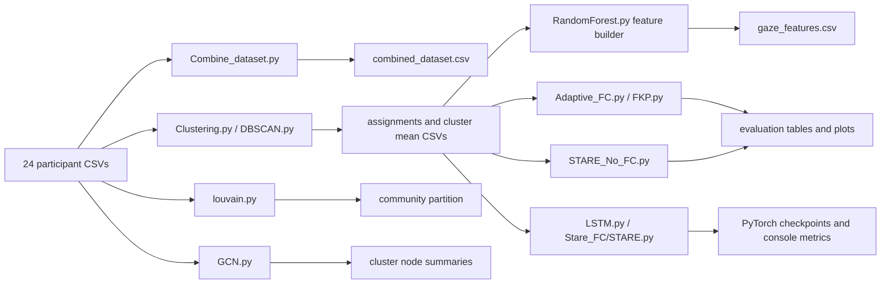

# Gaze Prediction via Fractional-Order Modeling

Research code for analyzing participant gaze behavior, grouping participants by gaze statistics, engineering gaze-motion features, and predicting future gaze coordinates. The repository compares classical clustering, graph/community methods, fractional-order predictors, a fractional Kalman filter, and Transformer/LSTM sequence models.

> [!IMPORTANT]
> This is an exploratory research repository, not a single packaged application. The scripts are independent experiments with overlapping responsibilities. Some filenames do not match their current implementation (`DBSCAN.py` uses K-means, and `RandomForest.py` builds features but does not train a Random Forest). Read [Current limitations](#current-limitations) before interpreting the results.

## Research objective

The project investigates two connected questions:

1. Can participants be grouped by similar gaze behavior?
2. Can the history-dependent nature of gaze motion be modeled with fractional calculus to improve future-coordinate prediction?

Fractional-order models are useful here because a Grünwald–Letnikov (GL) derivative incorporates a finite history of earlier samples instead of depending only on the immediately preceding state. The code exposes the fractional order `alpha` and history length `r`, and some methods adapt `alpha` at every prediction step.

## Repository at a glance

```text
.
├── DataSet/                      # 24 raw participant recordings
├── Materials/                    # 100 background/research PDFs (not executable)
├── Working/
│   ├── Dataset/                  # Four cluster-mean trajectories
│   ├── Stare_FC/STARE.py         # Transformer + fractional features
│   ├── results/                  # Saved tables and plots
│   ├── *.py                      # Analysis and modeling experiments
│   ├── *.csv                     # Generated assignments/features
│   └── *.pt, *.pth               # PyTorch checkpoints
├── *.pth                         # Additional model checkpoints
├── PROJECT_ANALYSIS.md           # Earlier high-level project analysis
├── REPO_REPORT.md                # Earlier technical handover report
└── README.md                     # This guide
```

The raw data and source code are the authoritative inputs. CSVs, plots, and checkpoints elsewhere in the repository are experiment artifacts and may have been produced by different runs.

## Preprocessed datasets

Non-destructive, audited datasets are available under [`preprocessed files/`](preprocessed%20files/). See [`PREPROCESSING_REPORT.md`](preprocessed%20files/PREPROCESSING_REPORT.md) for every dataset-specific decision, change summary, validation result, and the correct downstream use. The complete collection can be regenerated with `preprocessed files/preprocess_datasets.py`; original raw and historical artifact files are never overwritten.

Equal-length copies of the 33 sample-level processed datasets are available under [`trucate_files/`](trucate_files/). Every included CSV has 6,284 rows. The scope, exclusions, validation, and reproducible procedure are documented in [`TRUNCATION_REPORT.md`](trucate_files/TRUNCATION_REPORT.md).

## End-to-end data flow



There is no central orchestrator. Each script is run directly, and several output paths depend on the directory from which the script is launched.

## Dataset

### Raw recordings

`DataSet/` contains 24 CSV files and 209,614 total samples:

- `P01_PLAY.csv` through `P24_PLAY.csv`, except participant 12 is stored as `P12_READ.csv`.
- 23 files are labeled `PLAY` (200,948 rows); one is labeled `READ` (8,666 rows).
- Participant files range from 6,314 to 10,267 rows.
- The current files contain no missing values.
- Across the complete raw dataset, `x` ranges from -1661 to 3574, `y` from -1014 to 1917, and timestamps from 0 to 300000.
- The median positive timestamp interval is 32, which the feature code treats as milliseconds.

Every raw CSV has this schema:

| Column | Meaning |
|---|---|
| `participant` | Participant identifier such as `P01` |
| `set` | Recording set (`A`, `B`, or `C`) |
| `activity` | `PLAY` or `READ` |
| `x`, `y` | Gaze coordinates; values outside a nominal screen boundary are present |
| `timestamp` | Sample time, apparently in milliseconds based on the sampling interval |

### Cluster-mean recordings

`Working/Dataset/cluster_0_mean.csv` through `cluster_3_mean.csv` contain row-wise averages of participant trajectories assigned to a cluster. Their schema is `x`, `y`, `timestamp`, `participant`, `cluster`.

| File | Rows | Missing cells in current artifact |
|---|---:|---:|
| `cluster_0_mean.csv` | 9,180 | 8,598 |
| `cluster_1_mean.csv` | 7,492 | 0 |
| `cluster_2_mean.csv` | 8,926 | 4,743 |
| `cluster_3_mean.csv` | 8,611 | 0 |

The `participant` field is only the first/base participant used while creating the average; it does not mean that the file contains only that participant. Cluster files are generated by adding Pandas Series by row index without first resampling or truncating all members to a common length. Unequal lengths therefore create missing values. Downstream scripts usually impute or drop them, but that changes the effective data and should be fixed for rigorous experiments.

### Engineered feature table

`Working/gaze_features.csv` has 9,179 rows and 29 columns. It contains:

- time and coordinates: `t_sec`, `x`, `y`, `dt`;
- motion: `dx`, `dy`, displacement, speed, acceleration, direction;
- region-of-interest (ROI): ID, change flag, and dwell time;
- fixation/saccade fields: `fix_flag`, fixation duration, saccade amplitude;
- rolling context statistics;
- GL fractional derivatives `Dax_fc` and `Day_fc` plus `alpha_fc`;
- participant/cluster context when present;
- next-step targets `x_next`, `y_next`, `t_next`, and `dt_next`.

### Results already present

`Working/results/tables/` contains saved actual-versus-predicted tables. Metrics computed directly from their `error` columns are:

| Table | Rows | Mean error | Median error | Maximum error |
|---|---:|---:|---:|---:|
| Adaptive FC | 9,369 | 40.6808 | 36.0788 | 473.4587 |
| Fractional Kalman filter | 6,745 | 0.0000645 | 0.0000461 | 0.0252890 |
| STARE without FC | 6,284 | 20.0153 | 16.8972 | 161.3546 |

These numbers are not directly comparable without confirming the source dataset, scale, preprocessing, and evaluation protocol. In particular, the FKF values are on a dramatically different scale and its saved table has one missing cell.

## File-by-file code guide

### Data preparation and visualization

#### `Working/Combine_dataset.py`

Globs `trucate_files/raw/*.csv`, concatenates every truncated participant file with Pandas, and writes `combined_dataset.csv`. The input is resolved from the script location; the output remains relative to the current working directory. File ordering follows the filesystem/glob result and is not explicitly sorted.

#### `Working/P01_plot.py`

Loads `trucate_files/raw/P01_PLAY.csv`, sorts it by timestamp, and displays two interactive figures: a timestamp-colored gaze trajectory and a Seaborn KDE density heatmap. Both invert the y-axis to resemble screen coordinates. The script saves no image.

### Participant grouping

#### `Working/Clustering.py`

For each participant, the script standardizes `x` and `y` independently, then records the standardized means and variances. It computes a 24-by-24 Euclidean distance matrix and passes that matrix to `SpectralClustering(n_clusters=4, affinity="precomputed", n_init=100)`. It writes participant assignments plus four row-wise cluster means.

Important interpretation issue: a precomputed spectral-clustering affinity should represent similarity, but this script passes distance directly. In addition, per-participant standardization forces the means toward 0 and variances toward 1, making the four summary features nearly identical across participants. There is no fixed random seed, so assignments can vary.

The current saved spectral assignment is heavily imbalanced: cluster sizes are 17, 1, 3, and 3.

#### `Working/Improved_Clustering.py`

This modular replacement leaves `Clustering.py` unchanged. It extracts 37 coordinate-distribution, scanpath, speed, timing, covariance, fixation, and spatial-entropy features per participant; standardizes the resulting feature matrix across participants; and constructs a Gaussian RBF affinity using a median-distance bandwidth. It evaluates cluster counts 2 through 10 with Silhouette, Davies-Bouldin, and Calinski-Harabasz scores, selects the result using equal-weight metric-rank aggregation, and uses a fixed random seed. Cluster means are interpolated onto a shared uniform timestamp grid before averaging, preventing missing values from unequal time alignment. Outputs are written by default to `Working/Improved_Clustering_Output/`, with legacy-compatible CSVs at the top level and structured metrics, membership, cluster summary, output manifest, and JSON run summary under `reports/`.

#### `Working/DBSCAN.py`

Despite its name, this is a K-means baseline. It creates the same standardized participant summaries and Euclidean distance matrix, then runs `KMeans(n_clusters=4)` on each participant's row of distances. It writes `clustered_players_based_on_gaze.csv` but does not create cluster means. No `random_state` is set.

#### `Working/louvain.py`

Intended to construct a weighted participant-similarity graph and apply Louvain community detection. Edge weight is `1 / (1 + distance)`. However, `G = nx.Graph()` is recreated inside the outer participant loop; after the loop only the last participant's graph survives. Since standardized means are approximately zero, similarities also contain little distinguishing information. The current saved partition assigns all 24 participants to community 0.

Its row-wise community averaging selects the shortest member as a base, but it initializes the mean with that participant and then adds every participant including the base again, so the base is double-counted.

#### `Working/GCN.py`

Repeats the spectral grouping, creates a fully connected graph inside each cluster, and uses each participant's raw mean `x, y` as a node feature. A two-layer PyTorch Geometric GCN maps 2 features to 16 hidden units and then 4 outputs. The model is randomly initialized and never trained; its log-softmax output is printed but not used. Saved `cluster_<id>_final.csv` files contain the original node means and cluster label, not learned embeddings.

### Feature engineering

#### `Working/RandomForest.py`

This file does not import or train a Random Forest. `build_features()` cleans and sorts a gaze CSV, converts likely millisecond timestamps to seconds, derives kinematics, maps coordinates to an 8-by-6 ROI grid, detects fixations with an I-VT speed threshold of 80 px/s, computes rolling statistics over 10 samples, and adds fixed-order GL derivatives (`alpha=0.8`, memory `r=20`). It creates one-step-ahead targets and drops the final targetless row.

The default input is `trucate_files/cluster_means/cluster_0_mean_processed.csv`, while the default output `gaze_features.csv` remains relative to the launch directory.

### Fractional-order predictors

The fractional utilities use coefficients derived from generalized binomial terms:

```text
C(alpha, k) = Gamma(alpha + 1) /
              [Gamma(k + 1) Gamma(alpha - k + 1)]
```

Only the most recent `r=20` samples are used, so these are finite-memory GL-style approximations.

#### `Working/Adaptive_FC.py`

Loads `trucate_files/cluster_means/cluster_3_mean_processed.csv`, removes missing and duplicate timestamps, estimates a dominant positive time step, and linearly resamples `x` and `y` onto a uniform grid. At every eligible time step, golden-section search selects `alpha` in `[0, 1]` by minimizing error against the actual next sample, separately for x and y. It saves trajectory and alpha plots.

Because the next ground-truth sample is used to optimize `alpha` for that same prediction, the reported score is an oracle/in-sample fit, not a deployable out-of-sample forecast.

#### `Working/FKP.py`

Implements a four-state filter `[x, y, vx, vy]` with a constant-velocity transition, a GL fractional velocity correction, adaptive process noise, and a standard Kalman measurement update. Golden-section search chooses `alpha` using the next observed x coordinate; the same alpha is then used for y. The script displays plots interactively and does not currently save the tables or plots shown in its source, even though an FKF table and plot from an earlier run are present under `Working/results/`.

The first `r` output entries remain initialized to zero except the first point, so metrics over the complete array include a warm-up artifact. Like Adaptive FC, its alpha selection sees the next target.

### Deep sequence models

#### `Working/STARE_No_FC.py`

Creates 30-sample normalized `(x, y)` windows and predicts the next coordinate with a Transformer encoder: 2-to-128 input projection, sinusoidal positional encoding, three encoder layers with four attention heads, and a two-layer regression head. Defaults are 10 epochs, batch size 64, Adam at `1e-3`, and MSE loss.

The single DataLoader is shuffled and used for both training and evaluation. Consequently, the saved result is training-set performance, not held-out generalization. When a cluster-mean file contains one repeated participant label, grouping does not create participant-level separation.

#### `Working/LSTM.py`

Builds 30-step windows containing an ROI token and four fractional/context values per sample: `[D_alpha x, D_alpha y, alpha, normalized_time]`. A four-layer Transformer encoder produces context for a one-layer LSTM decoder. During training, the decoder uses teacher forcing; during inference, its own predicted gaze point is fed back autoregressively. It predicts five future samples, uses MSE/Adam (`1e-4`) for 10 epochs with batch size 32, clips gradient norm to 5, and saves `stare_fc_lstm_multistep.pth` relative to the launch directory.

There is no train/validation/test split, device selection, fixed seed, or checkpoint metadata. The visualization reports `100 * (1 - error / coordinate_diagonal)` for one selected window; this is a custom normalized score rather than conventional accuracy.

#### `Working/Stare_FC/STARE.py`

This is the cleanest temporally split deep experiment. Its inputs are the same 48 ROI vocabulary (8-by-6 grid) and four fractional/context features. Separate 64-dimensional embeddings are fused into a 128-dimensional representation, processed by three four-head Transformer layers, and mapped directly to five future `(x, y)` points.

Sliding windows are split chronologically into 70% training, 15% validation, and 15% test subsets. It trains for 10 epochs with Adam (`1e-4`) and MSE, then reports mean Euclidean error in normalized coordinates. Normalization and fractional-feature statistics are calculated on the complete series before splitting, so some distribution information still crosses the split boundary. The returned model is not saved.

## Installation

Python 3.10 or newer is recommended. The repository has no lockfile, package metadata, or requirements file, so create an isolated environment and install the libraries used by the experiment you plan to run:

```bash
python3 -m venv .venv
source .venv/bin/activate
python -m pip install numpy pandas matplotlib seaborn scikit-learn
python -m pip install torch networkx python-louvain
python -m pip install torch-geometric
```

`torch-geometric` is required only by `GCN.py`; `networkx` and `python-louvain` are required only by `louvain.py`; Seaborn is required only by `P01_plot.py`. Install PyTorch and PyTorch Geometric using builds appropriate for the machine's CPU/CUDA platform if the generic commands are unsuitable.

## Running the project

Run commands from the repository root unless a note says otherwise.

All executable experiment loaders under `Working/` now resolve their inputs from `trucate_files/`: participant-level utilities use `trucate_files/raw/`, cluster-0 models use the processed truncated cluster 0 mean, and the fractional baselines use the processed truncated cluster 3 mean.

```bash
# Optional unified raw CSV (writes ./combined_dataset.csv)
python Working/Combine_dataset.py

# Participant grouping (writes outputs to the current directory)
python Working/Clustering.py
python Working/Improved_Clustering.py
python Working/DBSCAN.py
python Working/louvain.py
python Working/GCN.py

# Feature generation (writes ./gaze_features.csv)
python Working/RandomForest.py

# Fractional baselines
python Working/Adaptive_FC.py
python Working/FKP.py

# Deep models
python Working/STARE_No_FC.py
python Working/LSTM.py
python Working/Stare_FC/STARE.py

# Interactive raw-data plots
python Working/P01_plot.py
```

To reproduce the existing convention of storing clustering artifacts inside `Working/`, launch the affected scripts from that directory instead:

```bash
cd Working
python Clustering.py
python DBSCAN.py
python louvain.py
python GCN.py
python RandomForest.py
python LSTM.py
```

Be aware that rerunning these scripts overwrites CSVs/checkpoints with nondeterministic outputs where no seed is configured.

## Checkpoints and other artifacts

| Artifact | Intended source/meaning |
|---|---|
| `Working/stare_fc_lstm_multistep.pth`, root copy | State dictionary from `LSTM.py` |
| `Working/stare_fc_multistep.pth` | Earlier STARE + FC multi-step checkpoint; current `STARE.py` does not save it |
| `Working/stare_fc_model.pth` | Earlier STARE + FC checkpoint |
| `Working/stare_fc_ts_multistep.pth` | Earlier timestamp-aware multi-step checkpoint |
| root `stare_fc_xy_t_multistep.pth` | Earlier x/y/time multi-step checkpoint |
| `Working/stare_gaze_best.pt` | Earlier/best STARE checkpoint |
| `Working/results/plots/` | Saved trajectory and adaptive-alpha PNGs |
| `Working/results/tables/` | Per-sample predictions and errors |

Only the LSTM checkpoint filename is produced by the current source exactly as written. The repository does not include inference scripts or architecture/version metadata for the other checkpoints, so loading them requires reconstructing the matching historical model definition.

## Materials and project documents

`Materials/` contains 100 PDF papers (about 343 MB). They are literature/reference material, not imported by any script. Most concern games, entertainment computing, gaze, behavior, or machine learning. Two titles are especially aligned with the fractional-calculus theme: *Analysis of football players motion in view of fractional calculus* and *A new collection of real world applications of fractional [calculus]*. Two publisher-style `1-s2.0-...` filenames appear alongside descriptively named papers, but the files are not byte-identical and should not be treated as confirmed duplicates without checking their bibliographic metadata.

`PROJECT_ANALYSIS.md` and `REPO_REPORT.md` are previous narrative audits. They are useful background, but this README corrects several details using the current files and measured CSV contents.

`.DS_Store` files are macOS filesystem metadata and have no project role.

## Current limitations

The most important issues to address before treating this as reproducible research are:

1. Standardize output locations and expose inputs/hyperparameters through command-line arguments.
2. Add `requirements.txt` or `pyproject.toml`, version pinning, fixed random seeds, and experiment metadata.
3. Resample participant trajectories to a shared time grid before cluster averaging; never rely on Pandas index alignment for unequal sequences.
4. Replace the distance passed as spectral `affinity` with a valid similarity kernel, and avoid per-participant standardization that collapses mean/variance features.
5. Move all preprocessing fits inside the training partition and use held-out participants or held-out chronological blocks.
6. Select adaptive `alpha` from history/training data only; current fractional baselines use the target being predicted.
7. Add conventional metrics (MAE, RMSE, mean Euclidean distance) in original coordinate units with a shared evaluation script.
8. Either add a supervised/unsupervised GCN objective or label the current GCN strictly as a random-embedding demonstration.
9. Rename misleading files or implement the algorithms their names promise.
10. Add tests for GL coefficients/derivatives, ROI boundary handling, window construction, aggregation, and data leakage.

## Reproducibility status

The Python files parse successfully, but a full execution was not performed as part of this documentation pass because model training is expensive and the current environment does not contain every optional dependency. At audit time, NumPy, Pandas, Matplotlib, and scikit-learn were available; Seaborn, PyTorch, NetworkX, python-louvain, and PyTorch Geometric were not installed. Existing user-owned CSVs, checkpoints, plots, and deleted root-level artifacts were left unchanged.

## Suggested next development step

Refactor the project into a small configuration-driven pipeline:

```text
raw data -> validated/resampled sequences -> reproducible clustering
         -> leakage-safe train/validation/test datasets
         -> common model interface -> common metrics and saved run manifest
```

That would preserve the experimental models while making their comparisons scientifically meaningful and easy to reproduce.
